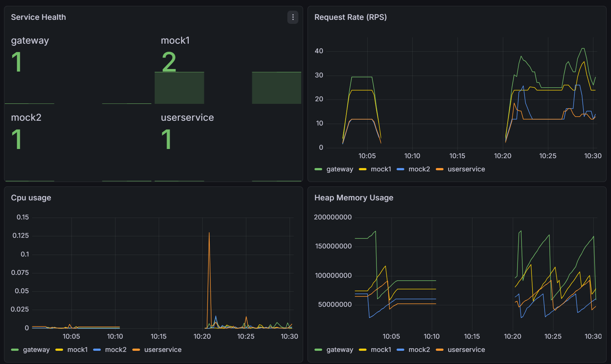
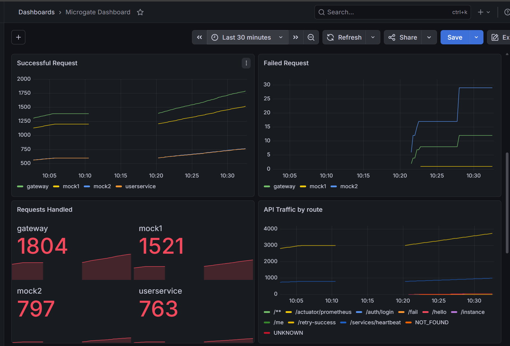
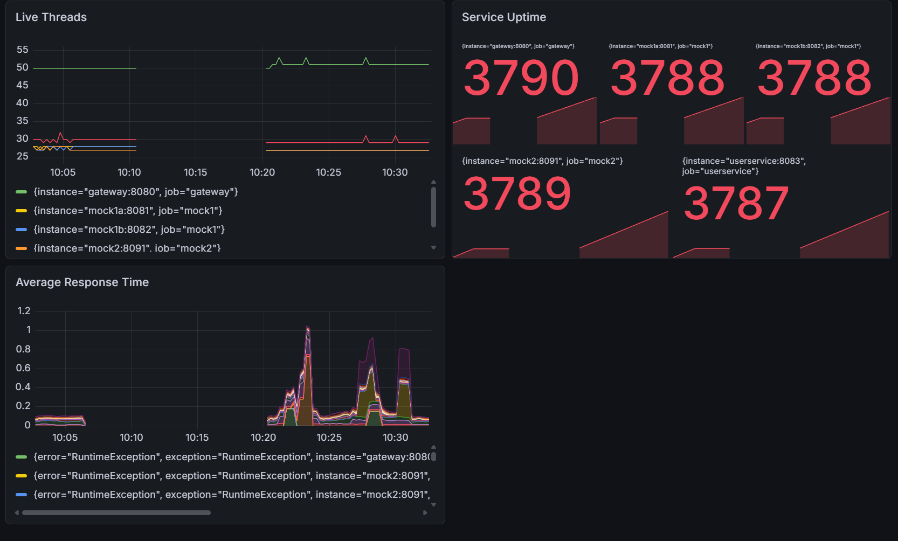
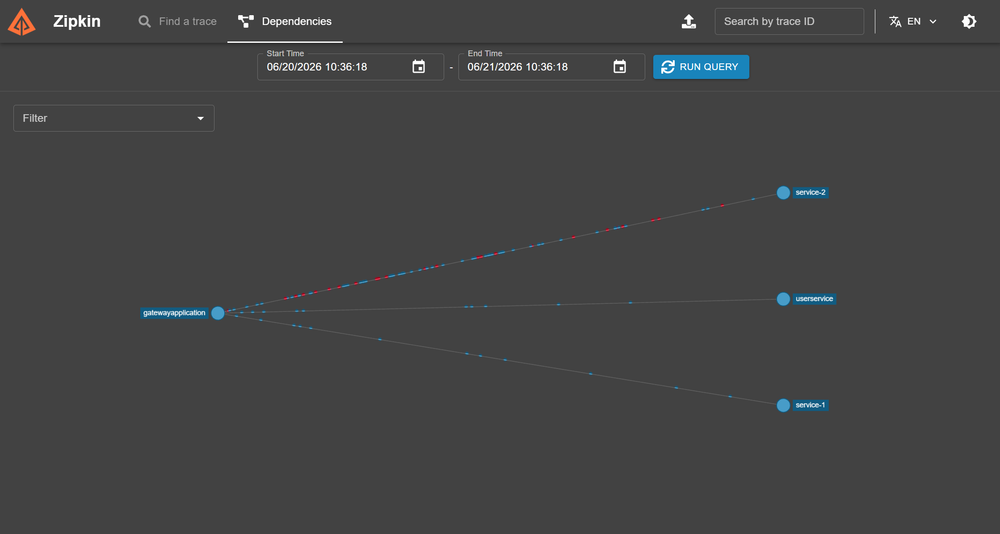
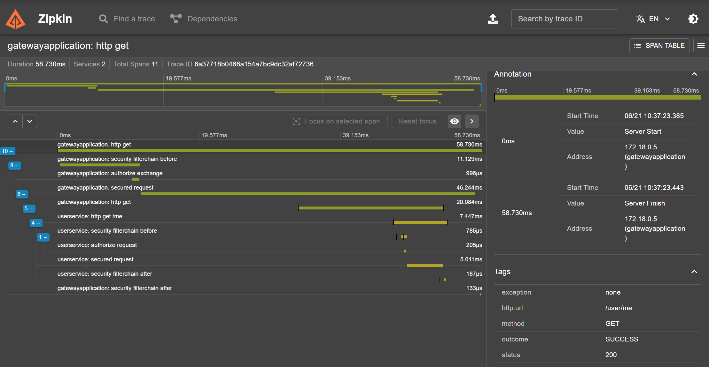
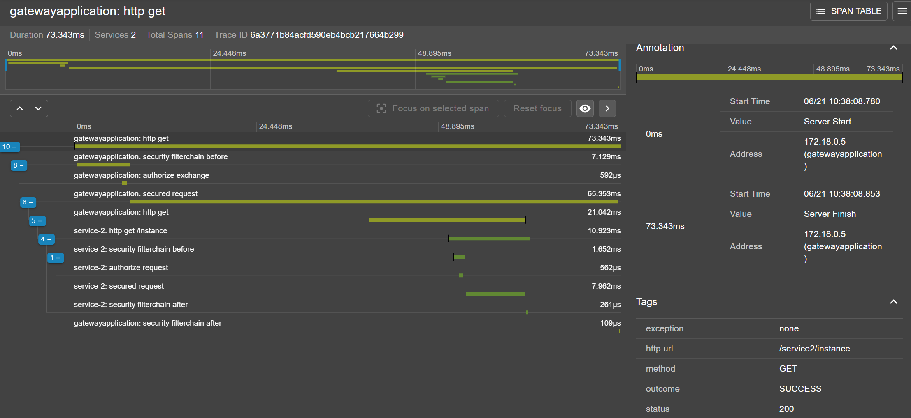

# MicroGate

### API Gateway & Service Registry Platform

MicroGate is a custom-built API Gateway platform that demonstrates how modern distributed systems manage:

- Service Discovery
- Dynamic Routing
- Load Balancing
- JWT Authentication
- Rate Limiting
- Circuit Breaking
- Distributed Monitoring
- Request Tracing
- Observability

The project is designed to showcase infrastructure engineering concepts commonly found in production microservice environments.

MicroGate was built to understand and implement the core infrastructure components used in large-scale microservice architectures. In organizations where applications are composed of dozens of independent services, an API Gateway acts as the central entry point responsible for traffic management, service communication, security enforcement, fault tolerance, and system observability. This project recreates those responsibilities from scratch to demonstrate how production systems handle request routing, service discovery, load balancing, monitoring, and reliability at scale.

---
# Architecture

```text
                    ┌─────────────┐
                    │   Client    │
                    └──────┬──────┘
                           │
                           ▼
                ┌─────────────────────┐
                │   API Gateway       │
                │                     │
                │ JWT Authentication  │
                │ Rate Limiting       │
                │ Service Registry    │
                │ Load Balancer       │
                │ Circuit Breaker     │
                │ Request Tracing     │
                └─────────┬───────────┘
                          │
         ┌────────────────┼────────────────┐
         ▼                ▼                ▼

   User Service      Mock Service 1    Mock Service 2
      8083          8081 / 8082         8091

                          │
                          ▼

                     MySQL
                     Redis

                          │
                          ▼

       Prometheus → Grafana → Zipkin
```

---

# Features

## Service Registry

- Dynamic Service Registration
- Service Heartbeats
- Service Health Monitoring
- Automatic Status Updates
- Instance Management

## Routing Engine

- Dynamic Route Lookup
- Path-Based Routing
- Request Forwarding
- Healthy Instance Selection

## Load Balancing

- Custom Round Robin Algorithm
- Multiple Service Instances
- Traffic Distribution
- Instance Selection Logging

## Security

- JWT Authentication
- Protected APIs
- Request Validation
- Security Filters

## Rate Limiting

- Redis-Based Token Bucket
- IP-Level Rate Limiting
- Abuse Prevention

## Fault Tolerance

- Circuit Breaker
- Downstream Failure Protection
- Graceful Degradation

## Observability

- Distributed Tracing
- Request Logs
- Service Logs
- Gateway Metrics

## Monitoring

- Prometheus Metrics
- Grafana Dashboards
- Zipkin Traces

---

# Tech Stack

## Backend

- Java 21
- Spring Boot 3
- Spring WebFlux
- Spring Security
- Spring Data JPA
- Hibernate

## Database

- MySQL 8

## Cache

- Redis 7

## Monitoring

- Prometheus
- Grafana
- Zipkin

## Containerization

- Docker
- Docker Compose

---

# Screenshots

## Grafana Dashboard Overview





---

## Zipkin Dependency Graph



---

## Distributed Trace Example 1




---

# Dockerized Deployment

The entire platform can be started using Docker Compose.

## Services

| Service | Port |
|----------|----------|
| Gateway | 8080 |
| User Service | 8083 |
| Mock Service 1 Instance A | 8081 |
| Mock Service 1 Instance B | 8082 |
| Mock Service 2 | 8091 |
| MySQL | 3307 |
| Redis | 6379 |
| Zipkin | 9411 |
| Prometheus | 9090 |
| Grafana | 3001 |

---

# Running the Project

## Clone Repository

```bash
git clone https://github.com/your-username/microgate.git

cd microgate
```

## Start Everything

```bash
docker compose up -d
```

Verify:

```bash
docker ps
```

Expected Containers:

```text
gateway
userservice
mock1a
mock1b
mock2
mysql
redis
zipkin
prometheus
grafana
```

---

# Service Registry

Services register themselves inside the Gateway Registry.

Example:

```text
SERVICE-1

├── service1-8081
└── service1-8082

SERVICE-2

├── service2-8091
```

Each service sends heartbeat requests every 15 seconds.

---

# Load Balancing Demo

Two instances of SERVICE-1 run simultaneously:

```text
mock1a → 8081

mock1b → 8082
```

Gateway Routing:

```text
Request 1 → 8081

Request 2 → 8082

Request 3 → 8081

Request 4 → 8082
```

Round Robin selection is implemented manually inside the Gateway.

---

# Monitoring

## Prometheus

```text
http://localhost:9090
```

Tracks:

- Request Count
- Error Count
- Response Time
- JVM Metrics
- Service Health

---

## Grafana

```text
http://localhost:3001
```

Default Login:

```text
admin
admin
```

Dashboard includes:

- Gateway Health
- Service Availability
- Request Volume
- JVM Metrics
- Load Balancer Metrics

---

## Zipkin

```text
http://localhost:9411
```

Visualizes:

- Distributed Traces
- Request Flow
- Service Dependencies
- Request Latency

---

# API Testing

Swagger UI:

```text
http://localhost:8080/swagger-ui.html
```

Example:

```http
POST /user/auth/login
```

Gateway validates JWT before forwarding requests.

---

# Future Enhancements

- Weighted Round Robin
- Least Connections
- Distributed Registry
- Kubernetes Deployment
- Gateway Clustering
- Service Mesh
- API Analytics Dashboard
- Multi Region Routing

---


# Author

## Anmol Kumar

Backend Engineering • Distributed Systems • Microservices • System Design
